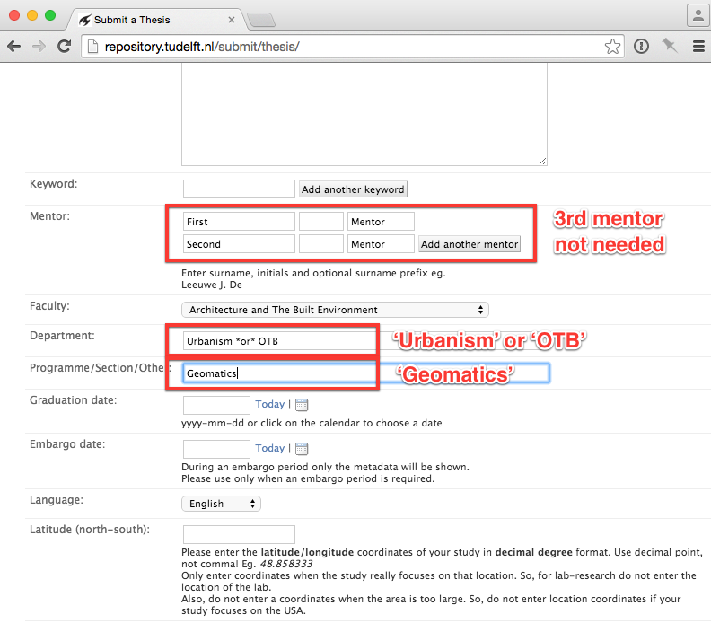
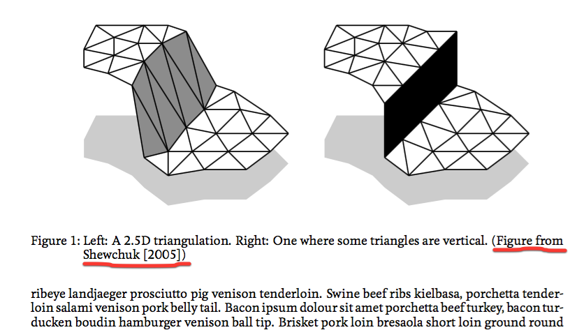

* Table of Content
{:toc}

- - -

#### Why are there 2 separates courses? GEO2010 & GEO2020

[GEO2010](http://www.studiegids.tudelft.nl/a101_displayCourse.do?course_id=35530) is for the preparation work and up to the P2 (including it).
If you pass P2, you pass GEO2010 (and get the 15 ECTS).
There is no grade attached to it, it's either a pass or a fail (a retake is possible though).

[GEO2020](http://www.studiegids.tudelft.nl/a101_displayCourse.do?course_id=35531) is for the rest of the graduation trajectory; you get a grade at the end of P5 (and the remaining 30 ECTS).

- - -

#### How do I pick a topic?

Two options:

  1. you like one MSc Geomatics staff and like her/his area of research? Contact directly that person to discuss a topic.
  2. have a look at the [potential topics]({{ "/potentialtopics/" | prepend: site.baseurl }}) offered and contact directly the person(s) listed.

- - -

#### Can I pick as First Mentor someone from another faculty?

No. Your first mentor, who also acts as your daily supervisor, must be a staff of the Faculty of Architecture involved in the Geomatics programme.

Your second mentor can however be any staff of the TU Delft.

Notice that at least one of the two mentors should hold a PhD degree.

- - -

#### Is there a template for the final thesis?

Officially no.
But we provide a [LaTeX one]({{ "/templates/" | prepend: site.baseurl }}) to help you start.

- - -

#### Can I do my thesis work at a company?

Yes and no. That is, you are allowed to pick a topic that is/was proposed by a company.
However, the main mentor of the project has to be a staff of the university and the project has to be a scientific one.

Working in collaboration with a company has many advantages (you get to know them, they get to know you) but it can also be problematic has more people need to agree on the topic (and finding one that is both scientific and useful for the company can be tricky).
That being said, in the past several students have done their graduation work in collaboration with a company and it went fine.
Just keep in mind that the topic you choose to tackle has to have a clear scientific objective, just like other topics done at the university.

In the [potential topics]({{ "/potentialtopics/" | prepend: site.baseurl }}) we propose, there are a few where a company (or a public administration department) is involved.
You can also propose yours if you have a contact.

- - -

#### I've just passed my P5, am I done?

No, you need to do one last thing to get your diploma: upload your final thesis (in PDF) and your final presentation slides (in PDF) to the [TU Delft repository](http://repository.tudelft.nl/submit/thesis/).

To ensure that all theses from the MSc Geomatics can be easily found and that there is consistency between them, please follow these guidelines:

- - -

#### Can I put figures I have found in papers/theses/websites?

Yes. As long as you make it crystal clear that this is *not* your own figure and that you put a clear reference in the caption.
Notice that if all your figures are taken from other sources, that gives the impression that you didn't develop your own solution.

- - -

#### Am I allowed to "reuse" the work of others? When does it become plagiarism?

Complex question to answer here.
First, read the [TU Delft position about fraud and plagiarism](http://studenten.tudelft.nl/en/students/legal-position/fraud-plagiarism/what-is-fraud/), and if in doubt speak to your daily supervisor and graduation professor.

There are [serious consequences](http://studenten.tudelft.nl/en/students/legal-position/fraud-plagiarism/consequences/) if you are caught. 

- - -

#### Who is the audience of my thesis?

In other words, who do I have to write for?

You should write so that your fellow students can understand your thesis: they have the same background as you have, but haven't specialised in exactly the same area.
So you don't need to explain at length what a GIS is, but all the more advanced methods techniques you used and developed during your graduation project should be described.

- - -

#### How long should my thesis be?

*As short as possible*, but it needs to cover all the criteria in the Appendix 1 of the [Graduation Manual]({{ "/rules/" | prepend: site.baseurl }})

Writing concisely is difficult and time-consuming.
Actually, it takes more time than writing long pieces.
As Blaise Pascal wrote (free translation):

> I would have written a shorter letter, but I did not have the time.

But since you insist on having a page number, around 75 pages is probably what is expected (with a "normal" amount of figures and tables). 

This plot shows the average number of pages of MSc theses at the University of Minnesota in different fields.
Geomatics is not in the list, but the average is clearly under 100, and in many fields a bit above 50.

- - -

#### Why do I need to write and submit a reflection?

You can read in the graduation manual that:

> At P4 a draft reflection must be handed in. A final version of the reflection must be included as a distinct part of the thesis (a separate chapter) or as a separate document at the P4.

This reflection is asked because several architecture students do not need to hand in a written thesis to graduate (but drawings, models, etc.) and that reflecting on your topic should be done.

For geomatics, your main deliverable is a written thesis, and we expect this reflection to be in the argumentation of your introduction and your conclusions. 
Therefore, to comply to the rules of the faculty, the suggestion is to copy the necessary parts from your introduction/conclusions to a separate document (or one appendix of the thesis); this part should be maximum two pages.

- - -

#### Can my thesis be written in Dutch?

No, it must be in English. And your presentations (P1, P2, P3, P4 and P5) must also all be made in English.

<!-- ### how about the scope of related work? -->

<!-- ### aim to cite papers, not websites -->
